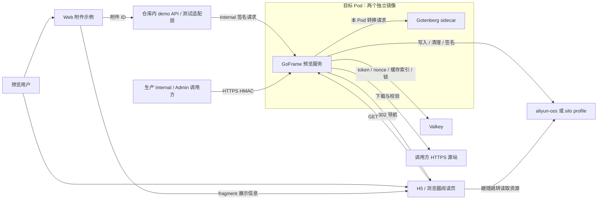

# 文件预览服务架构

> 当前范围由 [#36](https://git.shw.top/shw-project/file-preview-server/issues/36) 修正。dev@37a01a0 已有签发、受控预览、核心 Office 和两 profile；#37 收紧允许格式并补真实金山 WPS，#25 交付 H5/PC Web，#26 交付镜像与部署资料。其他格式永久不支持，小程序首版任务取消。

## 系统上下文

产品面向 H5 和 PC Web，共用图片/PDF 阅读页及仓库内附件示例。Internal 调用方负责业务授权和签发，Admin 负责查询/撤销；本服务不接管业务附件所有权、不保存业务 SQL 数据、不提供文件管理或编辑 UI。

图中均为目标组件关系，不是当前已部署拓扑。demo API 是仓库内测试适配层，不能混进生产服务的六条路由；Web 页面不能持有 Internal/Admin 密钥。所有文件先下载校验后存入指定 profile，再对用户签发短链；原样 PDF/安全图片不调用转换器。缓存和锁按 profile/config 身份隔离，签发必须 cache_ttl ≥ ttl。

## 组件与运行边界

| 组件 | 输入 / 输出职责 | 持有状态 | 失效影响 |
| --- | --- | --- | --- |
| Web 附件示例 | 附件 ID → 最小展示 DTO → 共享阅读页 | 当前页面的展示信息 | 用户返回列表重新获取 |
| H5 阅读页 | 清除 fragment、加载 token URL、图片/PDF 呈现与错误反馈 | 内存中的阅读状态，不持久化授权 | 关闭/恢复页面按客户端契约处理 |
| demo API | 白名单 fixture ID → Internal 签发 | 测试 fixture 映射与测试访问控制 | 不影响生产路由；测试环境不可用即不验收 |
| GoFrame 服务 | 签名鉴权、token 用例、预览编排、探针与有界清理 | 请求上下文、临时文件、不可变配置 | 无本机权威 token/锁，不需要粘性会话 |
| Valkey | token/nonce、缓存索引、lease 和维护索引 | 运行时共享状态 | 故障时受保护操作关闭，不能回退本地锁/匿名 |
| Gotenberg sidecar | 受检文件 → PDF | 单次请求临时数据 | 转换不可用，按探针与错误契约处理 |
| 对象存储 profile | 不可变对象、删除和有期限签名 | 文件字节 | 不返回不能验证可用的缓存目标 |

## 文档地图与唯一权威位置

| 边界 | 权威文档 | 当前实现状态 |
| --- | --- | --- |
| 综合审查与用户裁决 | [review.md](review.md) | 范围已冻结：18 个后缀，办公为 Word/Excel/PPT 三件套 |
| 调用方与浏览器 | [clients.md](clients.md) | 生产调用方外置；本仓库的 demo 是 v1 验收入口 |
| Demo 与测试环境 | [demo.md](demo.md) | 目标已定义，尚未创建 demo 代码 |
| 运行时主流程 | [runtime.md](runtime.md) | 签发、转换、等待、撤销与清理设计 |
| 服务与分层 | [services.md](services.md) | GoFrame 模块、请求和清理流程已实现；完整制品待 #26 |
| 领域 | [domains.md](domains.md) | TokenGrant、授权规则及存储端口已实现；仅产品允许集合由 #37 收紧 |
| 数据与对象存储 | [data.md](data.md) | Valkey 与两 profile 已交付，当前允许范围由 #37 收紧 |
| 存储适配与运行配置 | [storage-profiles.md](storage-profiles.md) | S04 公共端口、双 profile 配置/隔离与 CI 取证边界 |
| 文件格式 | [formats.md](formats.md) | 永久限定图片/PDF/微软与 WPS 办公格式，WPS/TIFF与拒绝旧格式已在 #37 实施，证据见PR #39 |
| HTTP API | [apis.md](apis.md) | 6 条业务/探针路由已实现，允许格式约束已由 #37 实施 |
| 安全 | [security.md](security.md) | HMAC/nonce/角色/TTL 已实现，完整版本安全证据仍须汇总 |
| 质量与失败恢复 | [quality.md](quality.md) | 非功能约束与验证要求，未测容量 |
| 架构决策 | [decisions.md](decisions.md) | 已确认约束、技术权衡与实施边界 |
| 测试与 CI | [testing.md](testing.md) | dev 既有 CI 已通过；新允许范围、实际 Web 与镜像待三个交付 Issue |
| 部署 | [deployment.md](deployment.md) | 镜像、deploy 声明与镜像级验证已交付；无任何集群部署或生产观察结论 |
| 接入交付 | [integration.md](integration.md) | 镜像、配置、签发与 H5/PC 接入说明；域名与 digest 待登记 |

产品价值、范围与验收以 [PRD](../prd/product.md) 为准；交互入口边界见 [design index](../design/index.html)。

路由、字段、签名串和 HTTP 语义只在 apis 定义；数据键、原子操作和生命周期只在 data 定义；域名/CORS 与展示状态在 clients；配置/镜像/Fleet/回滚在 deployment；预算约束与故障矩阵在 quality。运行时和决策文档引用这些定义，不再维护另一份 TTL、格式或路由清单。

## 当前结论

单 GoFrame 服务、同 Pod Gotenberg、Valkey、两 profile、项目内 Web 示例与 Fleet 只读边界继续有效。产品允许集合优先于转换器能力，旧代码和旧 CI 不代表新范围已经落地。当前剩余顺序 #37 → #25 → #26，#1 仅汇总，Milestone 在实际交付完成前保持 open。

首版以真实 H5/PC Web 自动化和可运行镜像放行，业务接入后收集反馈；不追加人工真实验收或固定观察期。18 个允许后缀见 formats，不能以架构稿或静态原型声称真实格式或镜像已通过。
