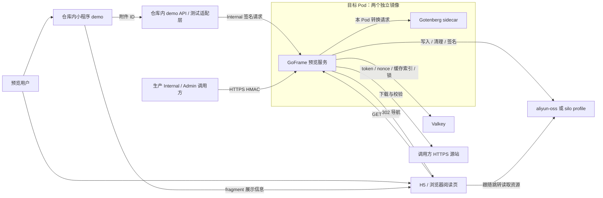

# 文件预览服务架构

> 状态：架构依据 #1/#5/#7/#9/#11 的已确认契约。S01–S03 已交付签发、原样 OSS 预览与六种 Office 转换；S04 正在交付双 profile。其余格式、完整 H5/小程序与发布制品仍按 #19–#27 推进。目标文档不代替实现、CI 或部署证据。

## 系统上下文

产品有两个用户交互入口：本仓库微信小程序 demo 和 H5 阅读页；浏览器也使用同一 H5 阅读能力。Internal 调用方负责业务授权与签发，Admin 调用方负责 token 查询/撤销。调用方通过本服务获得有期限的预览授权，服务不接管业务附件所有权，不保存业务 SQL 数据，不提供账号后台或文件管理 UI。

图中均为目标组件关系，不是当前已部署拓扑。demo API 是仓库内测试适配层，不能混进生产服务的六条路由；小程序和 H5 不能持有 Internal/Admin 密钥。所有文件先下载校验后存入指定 profile，再对用户签发短链；原样 PDF/安全图片不调用转换器。缓存和锁按 profile/config 身份隔离，签发必须 cache_ttl ≥ ttl。

## 组件与运行边界

| 组件 | 输入 / 输出职责 | 持有状态 | 失效影响 |
| --- | --- | --- | --- |
| 小程序 demo | 附件 ID → 最小展示 DTO → web-view | 当前页面的展示信息 | 用户返回列表重新获取 |
| H5 阅读页 | 清除 fragment、加载 token URL、图片/PDF 呈现与错误反馈 | 内存中的阅读状态，不持久化授权 | 关闭/恢复页面按客户端契约处理 |
| demo API | 白名单 fixture ID → Internal 签发 | 测试 fixture 映射与测试访问控制 | 不影响生产路由；测试环境不可用即不验收 |
| GoFrame 服务 | 签名鉴权、token 用例、预览编排、探针与有界清理 | 请求上下文、临时文件、不可变配置 | 无本机权威 token/锁，不需要粘性会话 |
| Valkey | token/nonce、缓存索引、lease 和维护索引 | 运行时共享状态 | 故障时受保护操作关闭，不能回退本地锁/匿名 |
| Gotenberg sidecar | 受检文件 → PDF | 单次请求临时数据 | 转换不可用，按探针与错误契约处理 |
| 对象存储 profile | 不可变对象、删除和有期限签名 | 文件字节 | 不返回不能验证可用的缓存目标 |

## 文档地图与唯一权威位置

| 边界 | 权威文档 | 当前实现状态 |
| --- | --- | --- |
| 综合审查与用户裁决 | [review.md](review.md) | 三项契约及两个原型入口已确认，产品定义复审零阻断 |
| 调用方与浏览器 | [clients.md](clients.md) | 生产调用方外置；本仓库的 demo 是 v1 验收入口 |
| Demo 与测试环境 | [demo.md](demo.md) | 目标已定义，尚未创建 demo 代码 |
| 运行时主流程 | [runtime.md](runtime.md) | 签发、转换、等待、撤销与清理设计 |
| 服务与分层 | [services.md](services.md) | GoFrame 模块、请求和清理流程已实现；完整制品待 S12 |
| 领域 | [domains.md](domains.md) | TokenGrant、授权规则及存储端口已实现；完整格式按切片交付 |
| 数据与对象存储 | [data.md](data.md) | Valkey 授权/期限/lease 与 OSS 已交付，S04 扩展双 profile |
| 存储适配与运行配置 | [storage-profiles.md](storage-profiles.md) | S04 公共端口、双 profile 配置/隔离与 CI 取证边界 |
| 文件格式 | [formats.md](formats.md) | 7 原样 + 6 Office 已有真实 CI，其余格式仍待后续切片 |
| HTTP API | [apis.md](apis.md) | 6 条新路由已注册；S04 实施依赖就绪检查 |
| 安全 | [security.md](security.md) | HMAC/nonce/角色/TTL 已实现，完整版本安全证据仍须汇总 |
| 质量与失败恢复 | [quality.md](quality.md) | 非功能约束与验证要求，未测容量 |
| 架构决策 | [decisions.md](decisions.md) | 已确认约束、技术权衡与实施边界 |
| 测试与 CI | [testing.md](testing.md) | S01–S03 真实服务 PR CI 已通过，S04 双 profile 按当前 head 验证 |
| 部署 | [deployment.md](deployment.md) | 已有 Gotenberg 组件；完整应用/发布制品待 S12，无生产部署结论 |

产品价值、范围与验收以 [PRD](../prd/product.md) 为准；交互入口边界见 [design index](../design/index.html)。

路由、字段、签名串和 HTTP 语义只在 apis 定义；数据键、原子操作和生命周期只在 data 定义；域名/CORS 与展示状态在 clients；配置/镜像/Fleet/回滚在 deployment；预算约束与故障矩阵在 quality。运行时和决策文档引用这些定义，不再维护另一份 TTL、格式或路由清单。

## 当前结论

单 GoFrame 服务、同 Pod Gotenberg、Valkey、两种 profile、项目内 demo 与 Fleet 只读观测是已确认方向。三项契约和原型交互已获用户确认，产品定义基线由 #13 / PR #14 记录；实现证据分别由 #15–#27 的 PR/head/CI 记录。尚未交付的格式、完整 H5/小程序和制品不能因前序切片通过而记为完成；本架构不代替真实平台或部署证据。

最新验收裁决见 [testing](testing.md) 与 [Issue #28](https://git.shw.top/shw-project/file-preview-server/issues/28)：v1.0.0 以 H5 自动化作为首版验收，取消人工真实验收与固定生产观察前置；业务接入后的真实反馈用于后续迭代。小程序工程仍交付，但 H5 自动化不能被描述为微信容器/真机兼容已验证。#15–#27 是当前交付切片，#1 仅为需求来源汇总。
