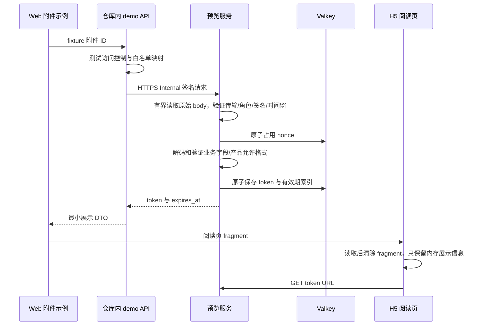
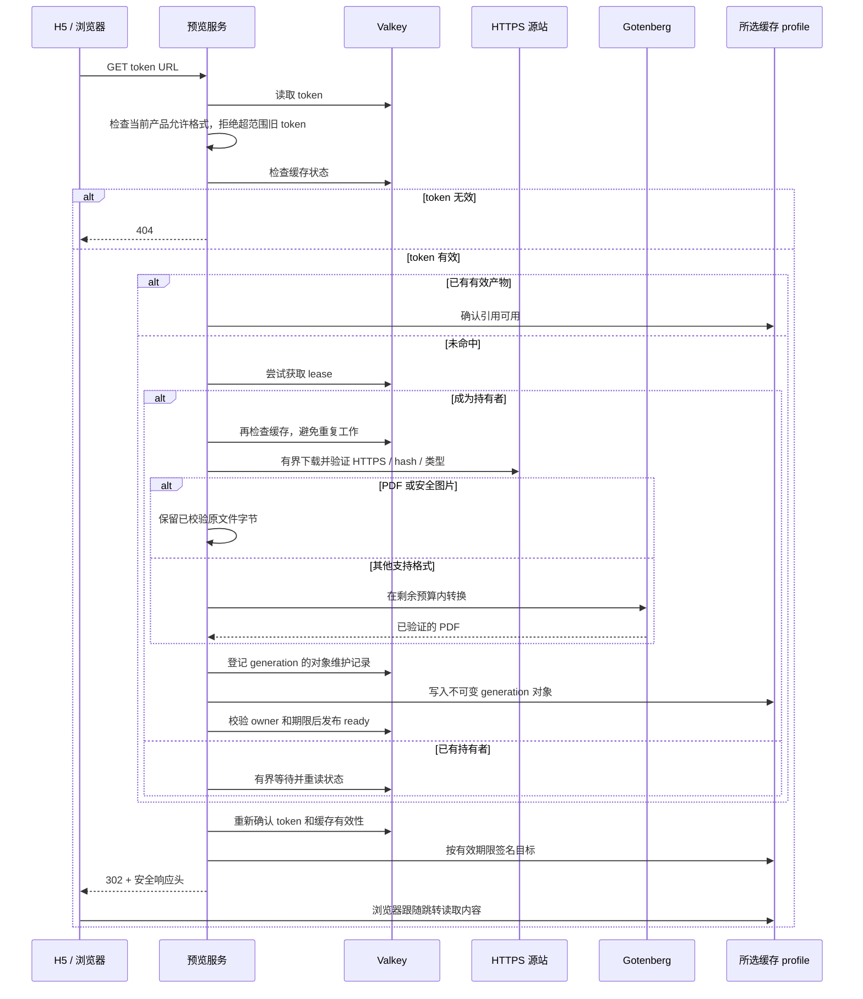

# 运行时主流程

本文件定义组件协作顺序；HTTP 与签名细节见 [apis](apis.md)，原子性和状态见 [data](data.md)，时间预算与异常恢复见 [quality](quality.md)。已确认裁决见 [review](review.md)：所有文件校验后受控存储，profile 内去重，cache_ttl ≥ ttl。

## 签发与展示信息

生产 Internal 调用方复用同一签发路径，业务附件鉴权在调用方完成。HMAC 原始 body 必须先验后解码，GoFrame 的参数验证不能提前消耗或重新序列化签名字节。鉴权通过后也不能把任意字段当作可信存储配置。签发与返回之间客户端断线不撤销已创建的 token；新 nonce 的重试可能签发第二个 token，这是既有非幂等签发边界。

## 预览解析与转换

图适用于全部支持文件：持有者二次检查若已命中，直接复用本 profile 已校验的产物，不再下载转换；任一阶段失败立即退出对应分支，按 quality 返回错误，不继续上传或发布 ready。不同 profile 的同 hash 请求独立准备，不复用或复制其他 profile 的对象。PDF/安全图片原样入库，不调用 Gotenberg；所有 302 均指向所选 profile，绝不返回源 URL。签发时即保证缓存期限不早于 token 期限，读取和重建都不能重新起算授权。

进程内取消不是分布式事务：请求中断后应取消下载/转换并释放自身资源；已经完成的上传可能成为孤儿，按维护索引回收。等待者取消只退出自己的等待，不能释放他人的 lease。持有者失败后其他请求仅在 lease 可安全重新获取且仍有请求预算时重新检查，不无限自动重试坏文件。所有请求都受独立的 token 有效性约束。

## 管理查询与撤销

Admin 请求经过相同签名/nonce 链路后查询活跃 token 或幂等撤销。列表以主 token 记录为有效性真相；索引中过期或已撤销的成员不能展示。分页发生并发变化不承诺快照，具体 DTO 与分页契约见 apis。

撤销的线性化点是 Valkey 原子删除 token/索引的操作成功。预览在发送 302 前最后一次有效性读取与撤销可能并发：如果有效性读取先完成，该在途请求仍可能发出短链；撤销后开始的新解析必须 404。不能声称能追回已开始发送的响应或客户端已经收到的 URL，测试应区分两种顺序。

## 清理与进程退出

应用内清理循环分批认领到期对象，先以条件更新把候选 generation 置为 deleting，再删除对象并清除维护记录。对象存储删除失败时保留可重试记录；缓存续期碰到 deleting 时不能复活正在删除的引用。新一轮生成使用新 generation，旧清理者只能删除自己认领的对象。

关闭进程时先停止接收新任务与清理认领，readiness 退出可服务状态，在关闭预算内取消/排空在途请求；只安全释放自己的 lease。超时退出依靠 lease 到期与维护记录恢复，不能清空共享缓存来“修复”状态。下一副本接续不需要读取另一副本临时文件。
